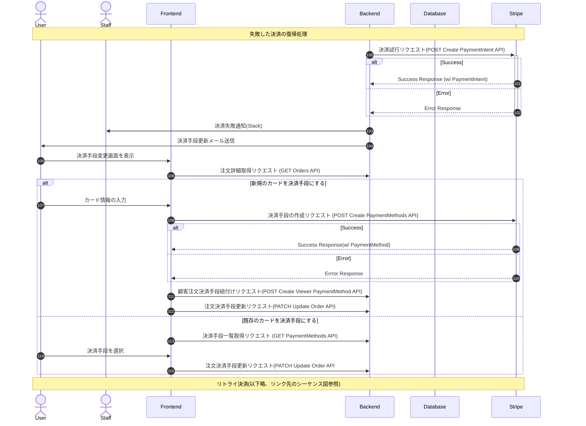

```mermaid
sequenceDiagram
actor User
actor Staff
participant Frontend
participant Backend
participant Database
participant Stripe
link Stripe : Create PaymentMethod API @ https://stripe.com/docs/js/payment_methods/create_payment_method
link Stripe : Attach PaymentMethod API @ https://stripe.com/docs/api/payment_methods/attach
link Stripe : Create PaymentIntent API @ https://stripe.com/docs/api/payment_intents/create

autonumber 100
    note over User,Stripe : 失敗した決済の復帰処理
    Backend->>+Stripe: 決済試行リクエスト(POST Create PaymentIntent API)
    alt Success 
        Stripe-->>Backend: Success Response (w/ PaymentIntent)
    else Error
        Stripe-->>-Backend: Error Response
    end
    Backend->>Staff: 決済失敗通知(Slack)
    Backend->>User: 決済手段更新メール送信
    User->>Frontend: 決済手段変更画面を表示
    Frontend->>Backend: 注文詳細取得リクエスト (GET Orders API)
    alt 新規のカードを決済手段にする
        User->>Frontend: カード情報の入力
        Frontend->>Stripe: 決済手段の作成リクエスト (POST Create PaymentMethods API)
        alt Success
            Stripe-->>Frontend: Success Response(w/ PaymentMethod)
        else Error
            Stripe-->>Frontend: Errror Response
        end
        Frontend->>Backend: 顧客注文決済手段紐付けリクエスト(POST Create Viewer PaymentMethod API)
        Frontend->>Backend: 注文決済手段更新リクエスト(PATCH Update Order API)
    else 既存のカードを決済手段にする
        Frontend->>Backend: 決済手段一覧取得リクエスト (GET PaymentMethods API)
        User ->>Frontend: 決済手段を選択
        Frontend->>Backend: 注文決済手段更新リクエスト(PATCH Update Order API
    end
    note over User,Stripe : リトライ決済(以下略、リンク先のシーケンス図参照)
```